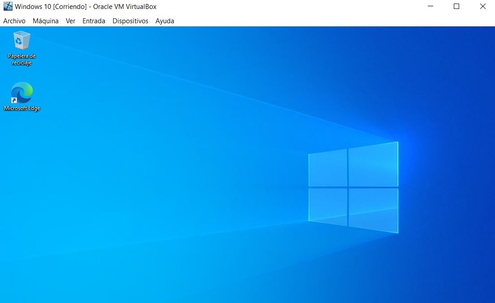
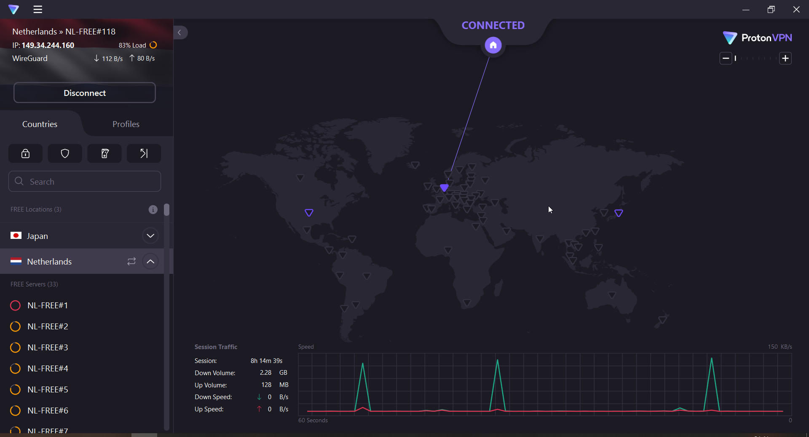
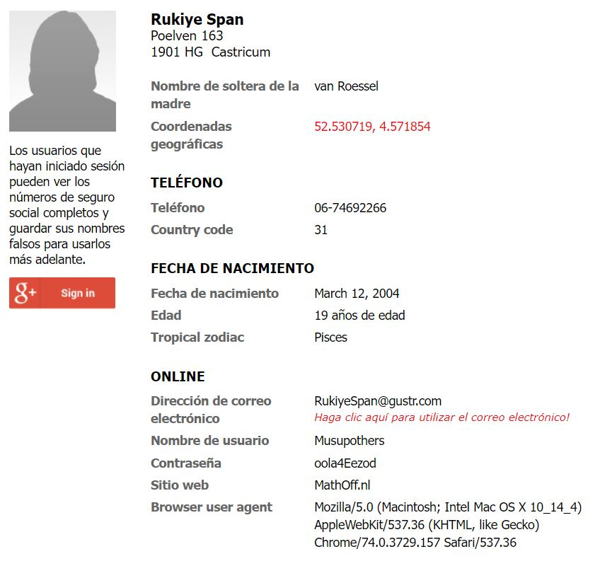
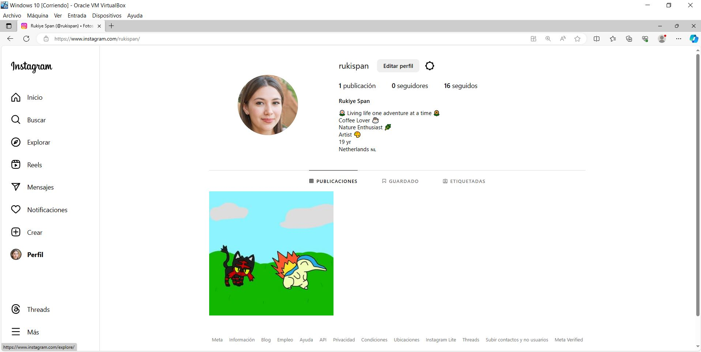

# Perfil Sock Puppet
## ¿Que es un Sock Puppet?
Un "Sock Puppet" es un término utilizado en internet para referirse a una identidad falsa creada en línea. En este contexto, un Sock Puppet se refiere específicamente a la creación de una identidad ficticia con la intención de engañar a otros usuarios, manipular opiniones, o influir en discusiones en línea. Por lo general, los Sock Puppets son utilizados para ocultar la verdadera identidad y para promover un determinado punto de vista o agenda.

## Usos habituales de los Sock Puppets

1. **Manipulación de la opinión pública:** Algunas entidades pueden usar Sock Puppets para crear la ilusión de apoyo o rechazo hacia ciertas ideas, productos o servicios en línea.

2. **Marketing encubierto:** Las empresas a veces pueden utilizar Sock Puppets para promocionar sus productos o servicios de manera encubierta, sin revelar su verdadera identidad.

3. **Manipulación de debates en línea:** Los Sock Puppets pueden ser utilizados para influir en discusiones en línea y dirigir la conversación hacia ciertos temas o puntos de vista.

## Proceso de Creación

Para comenzar, el procedimiento inicial implica la configuración de una máquina virtual sin ningún tipo de datos personales asociados. Esta máquina virtual será instalada con el sistema operativo Windows en su estado predeterminado, asegurando así un entorno libre de cualquier conexión o referencia a información personal.

<!-- 

 -->

<!--  -->

Implementaremos una red privada virtual (VPN) para mantener la confidencialidad de nuestra actividad en línea. En este escenario específico, hemos optado por la utilización de ProtonVPN para garantizar un nivel óptimo de seguridad. Asimismo, nos conectaremos a un servidor ubicado en los Países Bajos, lo que nos permitirá enmascarar nuestra ubicación física y reforzar aún más la protección de nuestros datos y actividades en línea.

<!-- 

 -->

<!--  -->

Utilizaremos la web [fakenamegenerator](https://es.fakenamegenerator.com) para generar los datos de un persona inexistente.

<!-- 

 -->

<!--  -->

Ahora generaremos a la persona usando, [thispersondoesnotexist.com](https://thispersondoesnotexist.com)

<!-- 

 -->

<!--  -->

Una vez que recopilamos los datos requeridos, procedimos a la creación de una cuenta en una plataforma de redes sociales. En este caso, se optó por Instagram como el medio principal para exhibir y promocionar nuestro contenido artístico. La cuenta fue creada y se publicó una pintura. Además, se llevó a cabo la acción de seguir cuentas destacadas de artistas y entusiastas del arte, especialmente de la región de los Países Bajos

<!-- 

 -->

<!--  -->

